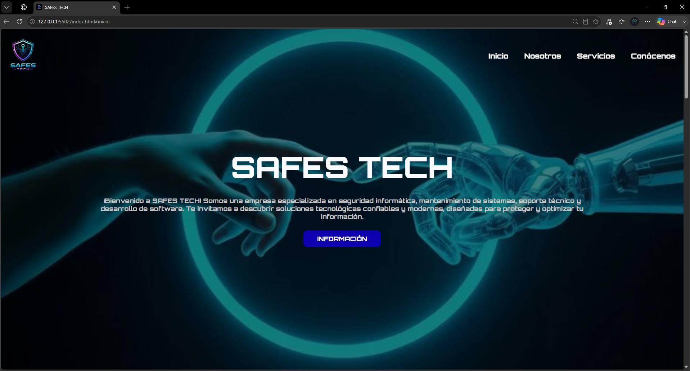

# 🛡️ SAFES TECH



Landing page responsive desarrollada para SAFES TECH, una empresa enfocada en soluciones tecnológicas, soporte técnico, mantenimiento, ciberseguridad y desarrollo de software.

## 📌 Descripción

Sitio web desarrollado como una landing page informativa para presentar la empresa, sus servicios, propuesta de valor y medios de contacto.

El proyecto busca ofrecer una experiencia visual moderna, clara y adaptable a diferentes dispositivos.

## 🚀 Características

- Diseño responsive.
- Navegación por secciones.
- Sección de presentación.
- Información institucional.
- Misión, visión y objetivos.
- Sección de servicios.
- Galería de imágenes.
- Video corporativo.
- Integración con redes sociales y medios de contacto.
- Adaptación para dispositivos móviles.

## 🛠️ Tecnologías utilizadas

- HTML5
- CSS3
- JavaScript
- Font Awesome
- Google Fonts

## 📁 Estructura del proyecto

```text
SAFES_TECH/
├── css/
│   └── style.css
├── img/
│   └── ...
├── js/
│   └── script.js
├── video/
│   └── SAFES-TECH.mp4
├── docs/
│   └── portada.png
├── .gitignore
└── index.html
```

## 🎯 Objetivo

Desarrollar una landing page moderna y responsive que permita presentar los servicios de SAFES TECH y comunicar de forma clara su propuesta tecnológica.

## 👨‍💻 Autor

**Alejandro Montoya**

Desarrollador de Software Junior | Backend

---

⭐ Proyecto desarrollado como parte de mi portafolio de desarrollo web.
